# ROOM 
SQL Lite con  ROOM, digrama de la arquitectura, obtenido de Google

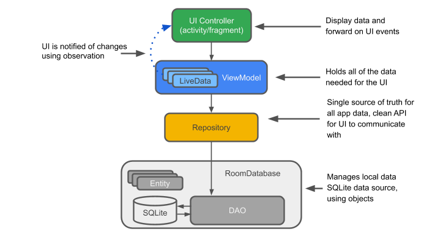

Tutorial basado en la documentacion mas reciente obtenida de google:
[sitio oficial](https://developer.android.com/training/data-storage/room/index.html)

Con ROOm guaradermos información localmente en el celular, esto con la finalidad de no desperdiciar recursos en una base de datos de nube.

Hay varios niveles para guardar infromación; la primera de éstas se llama Preferencias compartidas (Shared Preferences) esta limitada ya que es unicamente para guardar un solo objeto como por ejemplo Un Usuario, un correo electrónico, nombre, password, etc

Esto se usa generalmente cuando en una aplicación ingresamos continuamente, para evitar estar ingresando id y contraseña se guarda el dato , en esta forma unicamente podemos guardar objetos sencillos como estos.

Para guardar arreglos como Historial de examenes, áreas, fechas de ejecución, calificación final etc usaremos ROOM, es como si se usará SQL pero en el celular, haciendo las mismas funcionalidades. Room tiene la ventaja que se puede exportar a MongoDB  etc

El tercer sistema para guardar información es denominado Sistemas de Archivos pero este no es muy recomendado y este no se puede exportar a una base de datos.

En este caso usaremos ROOM, por su funcionalidad y gran eficacia, ya que por ejemplo un ajustador que se encuentra usando una aplicación para levantar un siniestro en un lugar donde no se tiene señal de internet, con ROOM podemos capturar los datos del siniestro en el celular y una vez que se tenga señal se puede indicar a la aplicación que dispare la información a un servidor donde se guardará la información capturada.

Room es coloquialmente un término para decir de manera informal " dar espacio".

Para poder usar ROOM en un proyecto debemos agregar las dependencias en el build.gradle (Module: app), por lo que nos vamos  a agregar primero:

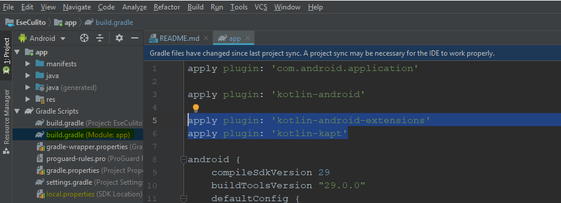

Dentro del build.gradle podemos añadir código, declarar variables, etc. Por lo que en este caso vamos a declarar una variable en la parte de dependencias, ésta variable la usaremos para indicar la versión que estamos usando y la ocuparemos posteriormente.

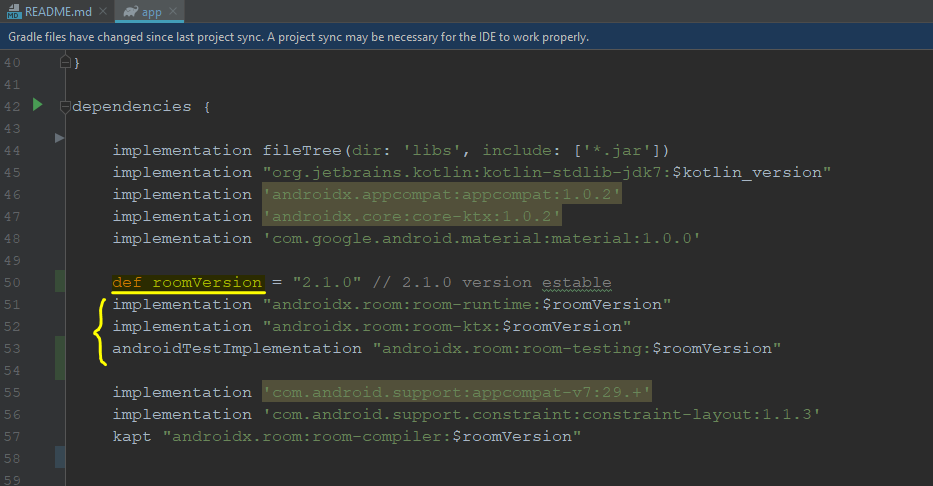

Las siguientes 3 lineas de código indican lo siguiente:

En la primer linea implementamos de la dependencia androidx runtime, en la segunda linea implementamos la biblioteca ktx y por último la tercer línea añadimos el paquete de testing, en éstas tres lineas usamos la variable que declaramos previamente para idnciar la versión de room que se esta usando.

Con el signo de $ indicamos que vamos a tomar la variable declarada con valor "2.1.0"

Posteriormente agregamos las siguientes lineas de código, la cual servirá para indicar que usaremos el MVVM (Model View View Model)Modelo Vista Vista Modelo, para que podamos hacer uso de este modelo anexamos las siguentes líneas de código

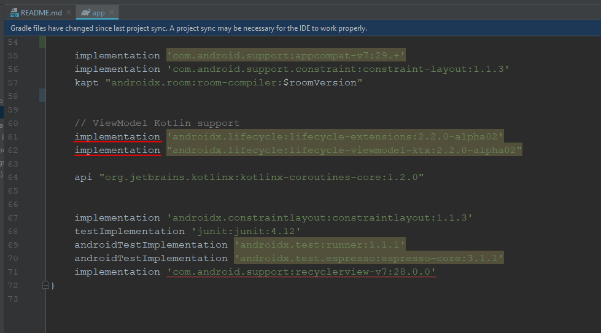

Con este modelo podremos enlazar los datos con la interfaz de usuario, estas son la última versión a usar.

La línea de código con la instrucción "courutine" se ejecutará una vez que haya un cambio en los datos que se ingresen en la interfaz de usuario, refrescará los datos.

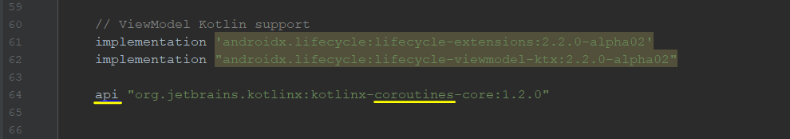

Una vez que ya tenemos agregadas las dependencias, lo que procede es empezar con lo que indica el diagrama de la arquitectura.

El primer paso de crear las entidades, éstas dependen de lo que voy a guardar, en est caso lo nombramos como AlumnoEntity

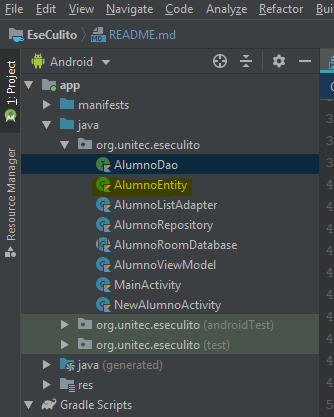

Importamos 3 elementos que serán de utilidad para poder usar nuestra base de datos, los cuales se marcan en amarillo.

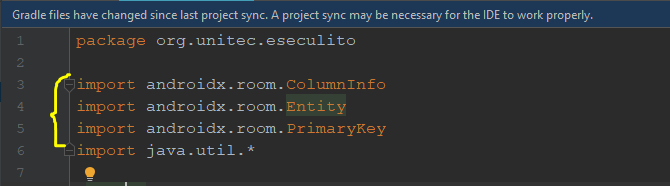

Hacemos una anotación inicializando con un "@", en este caso la nombramos como @Entity, la cual para poder utilizar la importamos dentro de los 3 elementos que se mencionó anteriormente. Todas las clases que vayan a ser entidades tienen que estar anotadas con esa anotación, por lo que para poder guardarlas deben tener esa anotación, A continuación se le coloca el nombre de la tabla donde se guardará la información que se solicitará en el celular.

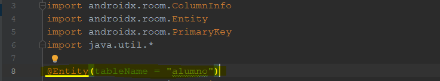

Nuestra clase se inicia como data class, esta clase usará el paradigma relacional, es decir , cada entidad tendrá un id unico e irrepetible para que la base de datos no entre en conflicto a la hora de guardar datos.

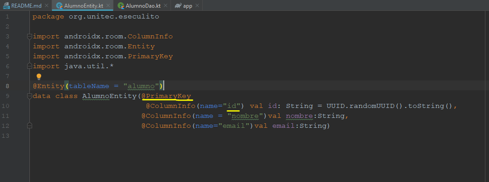

A continucación creamos un Constructor,los cuales en Kotlin se colocan inmediatamente después de la declaración de la clase entre paréntesis, en este caso nuestro constructor tiene 3 argumentos.

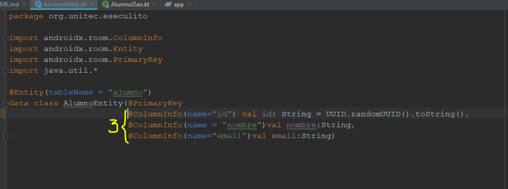

El primer argumento nos indica que estamos declarando un valor definido con la sintaxis VAL, en ésta caso el nombre es ID y éste será de tipo String y marcamos el caso para las siguientes dos líneas.

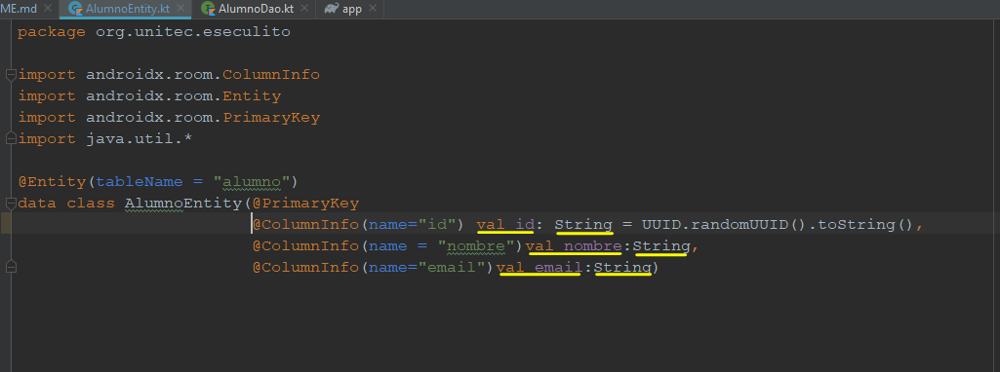

En este caso coincidió que los 3 valores son de tipo String, pero se pudo tener un valor Edad de tipo float. 

Ahora nos enfocaremos en la anotación @PrimaryKey , en donde sabemos que todas las bases de datos deben tener un identificador (id)como requisito, por lo que declaramos como PrimaryKey el ID, le colocamos información de la columna @ColumnInfo, indicando en la tabla creada como llamaremos a la columna que va a guardar el ID, en este caso llamaremos a la columna igual que los valores que declaramos.

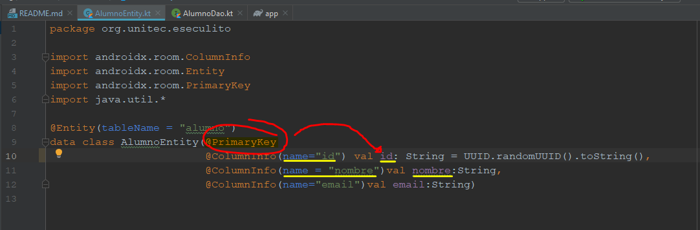

Solo el identificador tendrá la anotación de @PrimaryKey.

El ID como String para este caso lo vamos a inicializar usando el paquete java.util.*, con la ayuda de la clase UUID la cual es de gran utilidad pues genera ID de forma aleatoria de tipo String con la finalidad de evitar duplicados, por esa razón lo inicializamos directamente.

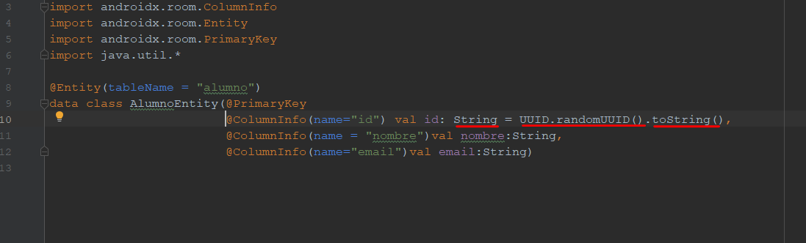

En el caso de que se quiera manejar ese ID como entero(int) solo necesitamos declararlo e inicalizarmos de la siguiente forma:

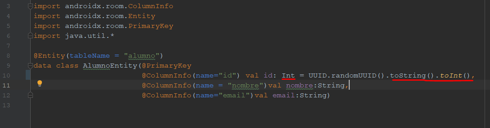

# El Segundo paso de acuerdo al diagrama mostrado en el inicio, ahora es generar los DAOS.

El DAO es el acceso a la base de datos, lo cual es independiente de la interfaz de usuario. Lo cual hace el manejo de datos localmente. Sería un homologo a los REPO que se crean en MongoDB, pero en este caso se llaman DAO.

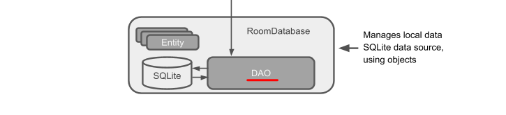

En Kotlin creamos una interface con la misma nomenclatura, en este caso lo nombramos Alumno Dao, en este caso no es una clase como generalmente se crean, en este caso será una interface de acuerdo a la arquitectura de SQLite.

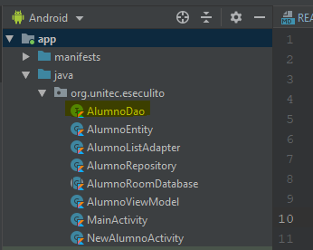
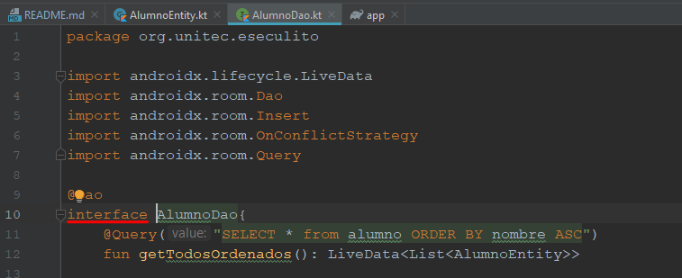

En este caso empezamos con la notación @Dao, la cual la importamos de la clase ROOM. La clase DAO unicamente contendrá el nombre de las operaciones que estaremos usando en SQL como por ejemplo: Insertar, Actualizar, Borrar, etc

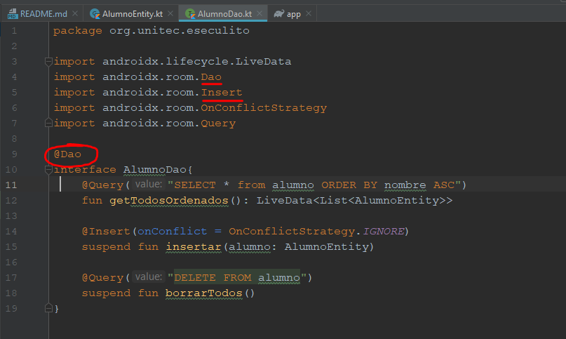

En Base de datos relacionales, cuando necesitamos hacer una consulta o una petición lo invocamos con la palabra QUERY , con SELECT hacemos una búsqueda por lo tanto la notación es como se indica a continucación: @QUERY seguida de SELECT, entre comillas colocamos la consulta como se realiza en SQL, si en SQL u ORACLE anotamos lo que escribimos entre comillas nos hara la búsqueda solicitada.

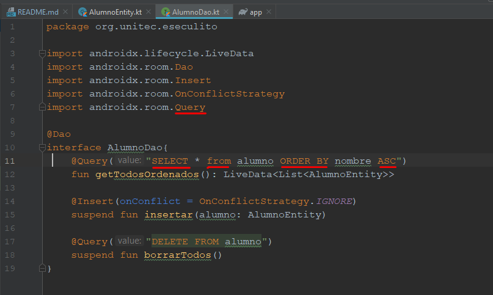

Una vez que se hace la búsqueda en la tabla alumnos y nos regrese el nombre de los alumnos en forma ascendente, colocamos la función con el nombre del método con el tipo de retorno, agregamos LiveData que previamente importamos, ésta nos será de utilidad ya que nos ayudará a estar refrescando los datos cada que se haga una captura de información. Para el tipo de retorno indicamos que es un List (que es el padre de los Arraylist) que es de tipo generico de AlumnoEntity (que fue lo que previamente indicamos que ibamos a guardar) y le indicamos que lo interprete como datos en vivo (livedata).

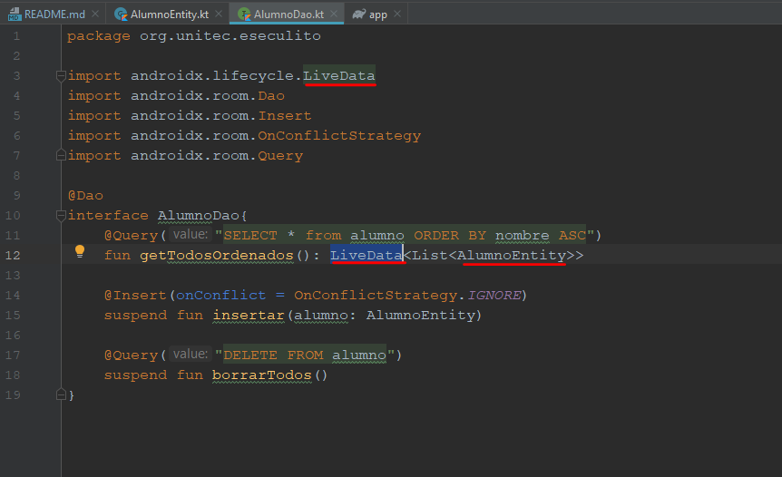

Para insertar datos es con @INSERT,en esta linea de código le estamos indicando que en caso que haya un clonflicto por el hecho que nos aparezca un "Nombre" repetido no haga caso o lo ignore.

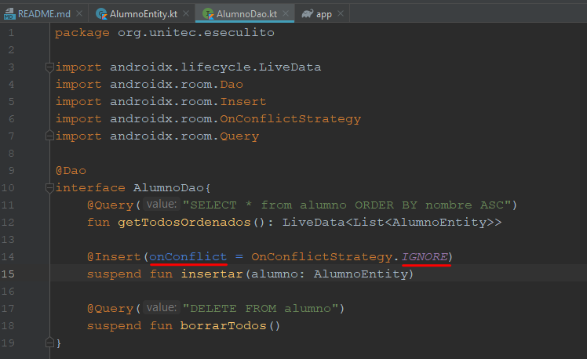

La siguiente linea se refiere a la acción que se va a ejecutar en la base de datos, es decir, si se está guardando información en la base de datos que ésta se suspenda hasta que no se actualice y entonces pueda continuar.

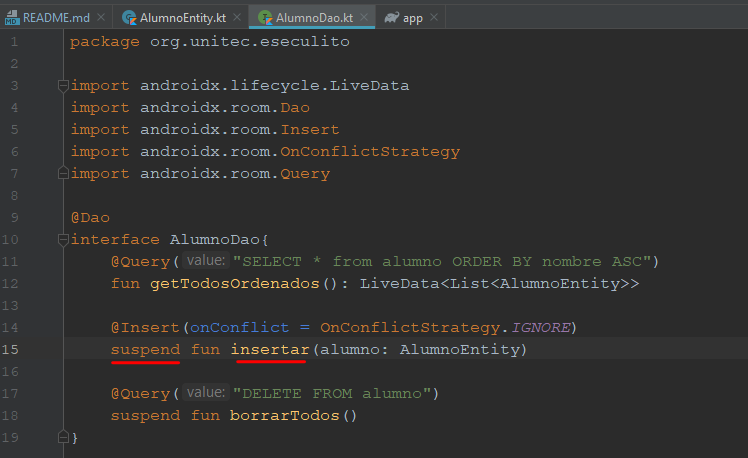

La siguiente linea de código es un QUERY de BORRADO, en este caso se indica que se borre todo lo de la base de datos. En este caso no usaremos esta instrucción pues no nos interesa borrar toda la información.

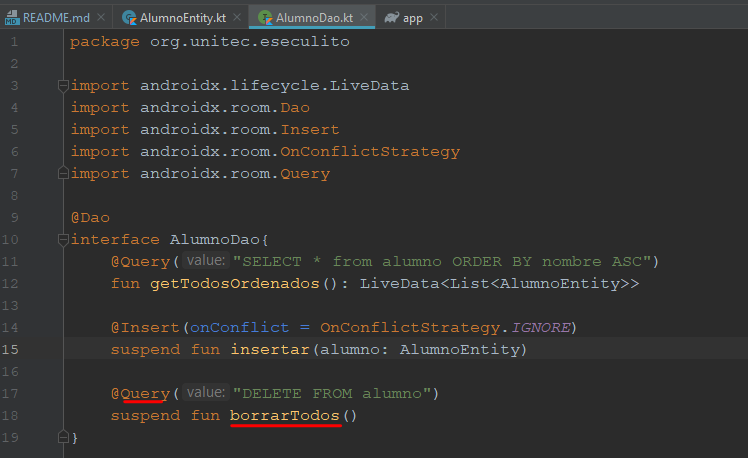

# El Tercer paso de acuerdo al diagrama mostrado en el inicio, ahora es generar la BASE DE DATOS.

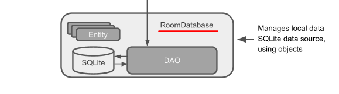

Una vez que tenemos el DAO ( la interface que tendrá las operaciones), vamos a crear una archivo para poder configurar la base de datos, en este caso creremos el archivo AlumnoRoomDatabase, pero en este caso lo ideal hubiese sido nombrar este archivo ControlEscolarRoomDatabase ya que esta base contendrá tanto alumnos, profesores, materias, etc. Lo dejaremos con el nombre dado previamente pero es importante nombrar las bases de datos de forma general y no en forma particular.

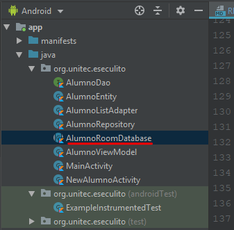

Vemos en primera instancia que es una clase abstracta, es decir, no podemos crear objetos a partir de ella, por lo tanto para que podamos hacer uso de ella debemos implementarla. La clase AlumnoRoomDatabase hereda de la clase RoomDatabase.

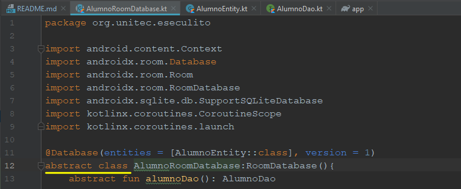

Una vez que ponemos la herencia de la clase RoomDatabase, esto nos indicará que y se convierte en una base de datos lo que marcamos en amarillo.

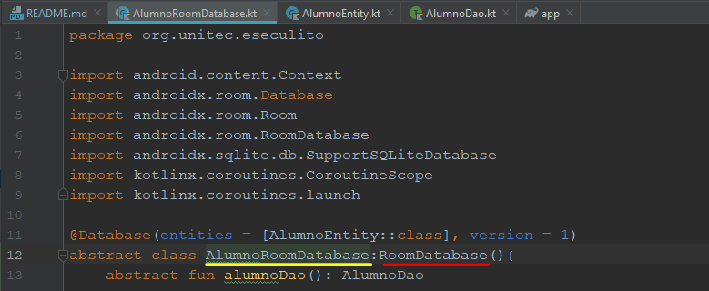

Primero colocamos la notación @Database para la base de datos, tal notación viene desde la clase android Room. Dentro de los parentesis colocamos las entities que ocuparemos, éstas son las Tablas que creamos por ejemplo en el código tenemos la entitie "AlumnoEntity::class", en caso de que tuvieramos más entidades como por ejemplo "Profesores::class" y "Materias::class", etc tendríamos que colocar éstas entidades dentro del corchete separados cada una de las entidades separadas de ",".

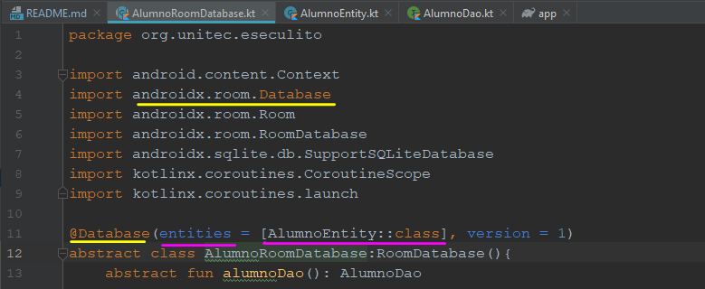

La siguiente parte del código es "version=1", es importante saber que el número de versión nos indicará los cambios que hacemos en nuestras entidades, por ejemplo, si requerimos anexar una neva entidad de nombre "Calificaciones", tendremos que ahora colocar como número de version=2, en caso de no hacer éstos cambios nos marcará error.

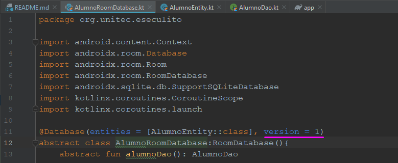

Despues de declarar el constructor AlumnoRoomDatabasevamos a crear el método abstracto alumnoDao el cual tiene un tipo de retorno AlumnoDao el cual fue creado previamente.

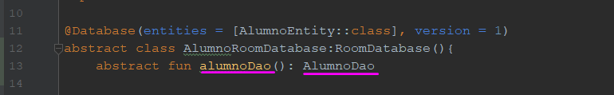

NOta: Si tuvieramos mas entidades como por ejemplo "Profesor" y "Materias", tendríamos que declararlos como: abstract fun profesorDao(): ProfesorDao y abstract fun materiasDao(): MateriasDao.

A continuación tenemos el objeto companion el cual es acompañante de la clase abstracta AlumnoRoomDatabase,  lo hacemos de esta forma por que dentro de la clase abstracta generamos ahi mismo un objeto ,en teoria de esta clase unicamente debemos tener 1 objeto, no podemos repetir las bases de datos repetidas.

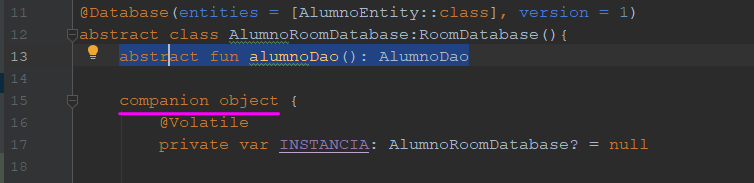

Tenemos declarado un @Volatile el cual se usa en kotlin para indicar que la base de datos que inicializa en null es la misma que declaramos en el número 1, su función además es realizar todos los cambios en automático en esas otras vistas o clases, es decir si hay un cambio que se ejecuten sin necesidad de "refrescar" absolutamente nada.

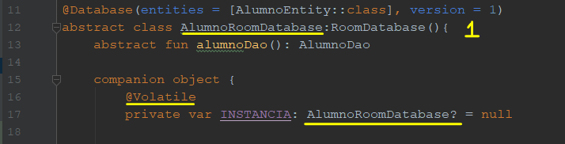

En la siguiente linea de código tenemos la función getDatabase que asi la nombramos la cual observamos que recibe dos atributos o parametros y el tipo de retorno es AlumnoRoomDatabase, es decir más adelante invocaremos el método getDatabase dentro del ViewModel.

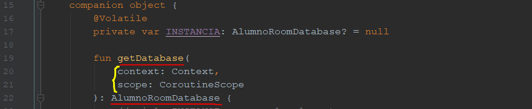

El primer atributo es el contexto el cua indica donde vamos a invocar la base de datos , el activity es donde lo vamos a invocar, el segundo atributo es el scope: CoroutineScope cuya función es refrescar de inmediato los cambios que se hagan. 

La siguiente linea de código indica la INSTANCIA la cual es la base de datos como lo declaramos previamente, lo declaramos con mayúsculas por que de esta manera nos cersioramos que solo habra una base de datos, el signo de interrogación pregunta si la base de datos ya existe, en caso de que no exista se espera hasta que sea creada tal base de datos, eso me garantizará que no exista un error y se cierre la aplicación inmediatamente, le indicamos el tipo de retorno que en este caso invocamos un método que se llama syncronized el cual supervisará que cualquier cambio o nueva acción que se ejecute se lleve a cabo de acuerdo a su funcionalidad, es decir, si hay una acción que se esta solicitando hacer pero previo a ésta se pidió otra acción que es primordial que se ejecute para poder realizar la segunda acción solicitada, lo que hace syncronized es que pausa la segunda acción hasta que la primera acción se termine de realizar y entonces da paso a que se ejecute la segunda acción, con la sentencia lock es un candado para detener o pausar la acción sin perder la información de la base de datos.

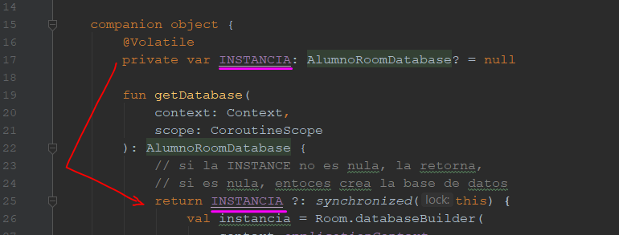

Las siguientes lineas de código creamos la base de datos AlumnoRoomDatabase:

Las siguientes tres lineas son métodos que se invocan después de haber creado la base de datos y son necesarias para que se construya.

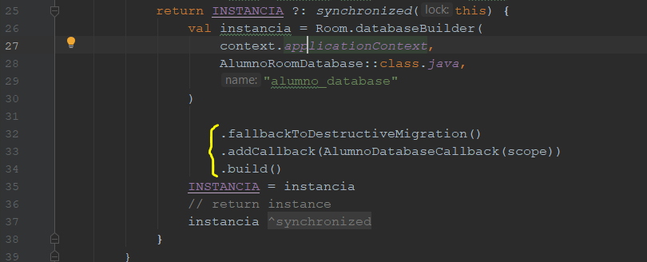

Tenemos la siguiente clase privada private class AlumnoDatabaseCallback que es parte del companion object, éste hara que se propague la CoroutineScope. Las siguientes lineas de código hacen que cada que se refresque la base de datos, se borren los nuevos datos. Debemos comentarlos para que no nos borre los nuevos datos que capturemos.

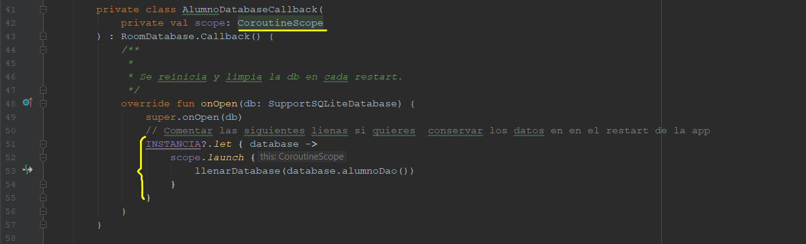

Las lineas finales, nos indicaban que los "nuevos" datos que ingresaramos a la base de datos deberían ser borrados, esto se hace invocando el método  alumnoDao.borrarTodos(), posteriormente solo dejaba por default los dos usuarios capturados, éstas líneas se deben de comentar pues la finalidad es guardar los nuevos alumnos que ingresen a la base de datos.

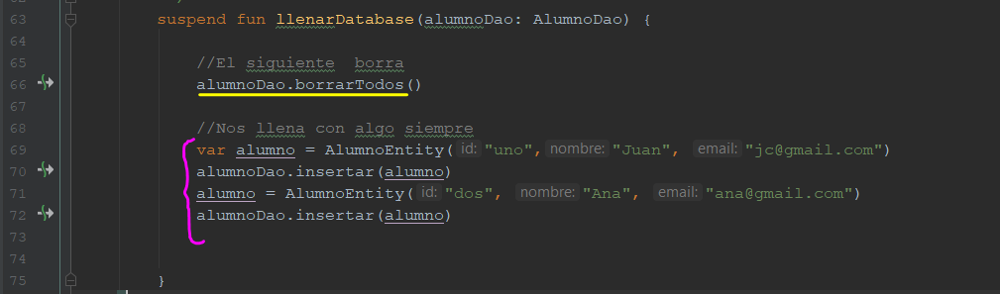

# El Cuarto paso de acuerdo al diagrama mostrado en el inicio, ahora es generar  El REPOSITORY

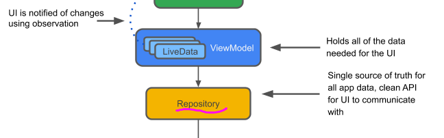

Este tipo es parecido al quese hacía en Spring, creamos una clase con la notación Raepository para saber que vamos a trabajr este elemento del diagrama con el nombre de la tabal o entidad que previamente se generó en la base de datos. Por lo tanto le damos el nombre de AlumnoRepository para decir que es un repositorio y se va a mapear a la entidad Alumno que a su vez es una tabla con los campos que ya le pusimos.

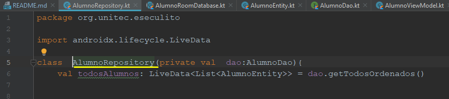

A continuación tenemos el constructor, tenemos un valor constante y el tipo de dato para inicializar el repositorio que es el AlumnoDao que es donde tiene las operaciones y lo que hace un repositorio es que le da implementación.

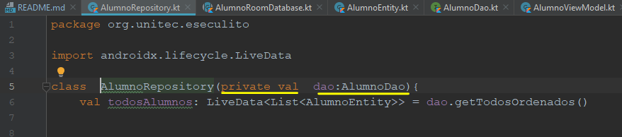

La linea suspend indica que mantiene fuera del thread o de la tarea principal que esta haciendo el programa y esta haciendo en el background las cosas para que cambie o actuelice, le damos el nombre del función insertar ( que fue el mismo que se le dio en la clase AlumnoDao en donde no tienen ninguna funcionalidad pues no tiene más argumentos), la cual tiene llaves de apertura y cierre que indica y con el dao invocamos la operación insertar.

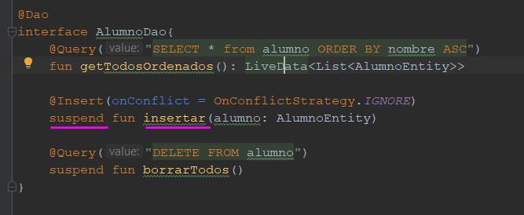

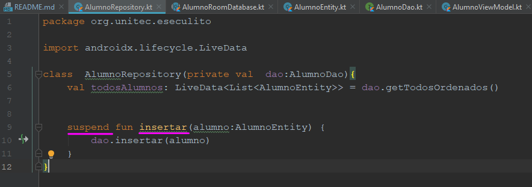

 La línea val todosAlumnos indica un atributo el cual regresa un LiveData el cual es un dato que se actualiza en automático genérico a un listado de AlumnoEntity, inmediatamente se inicializa  con el atributo dao.getTodosOrdenados (éste se encuentra declarado en la interface AlumnoDao).
 
 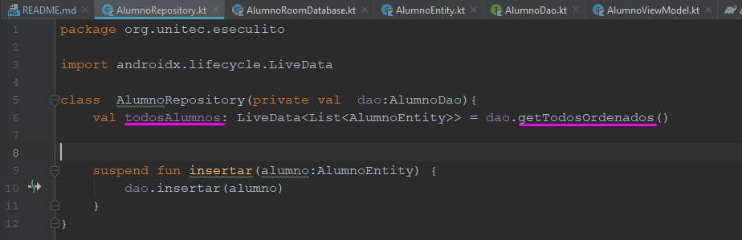
 
 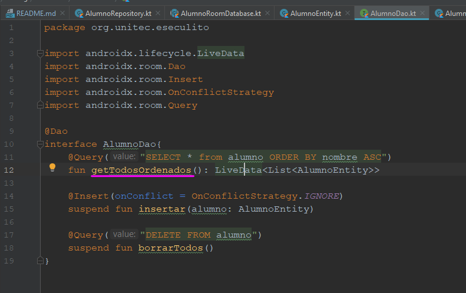
 
 El repositorio es un paso previo a ponerlo en la interfaz de usuario, lo cual vemos que todas la clases hechas no estan relacionadas con la interfaz de usuario con la finalida de separar la lógica de la base de datos con la lógica de interfaz de usuario.
 

# El Quinto paso de acuerdo al diagrama mostrado en el inicio, ahora es generar  El VIEWMODEL

El ViewModel es donde se enlazan las componentes de la vista al modelo con la interfaz de usuario. Por cada entidad creada debe haber un viewmodel:

-Creamos Entidad
-Creamos el Dao
-Creamos la base de datos
-Creamos el Repositorio
-A continuación crearemos el ViewModel

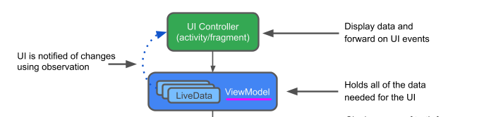

El viewmodel tiene la obligación de hacer la lógica de implementación de la base de datos.

La clase AlumnoViewModel recibe en el constructor (marcado con color amarillo) un atributo que se llama application de tipo Application que es de aplicación Android para que ya este disponible en todas las vistas.

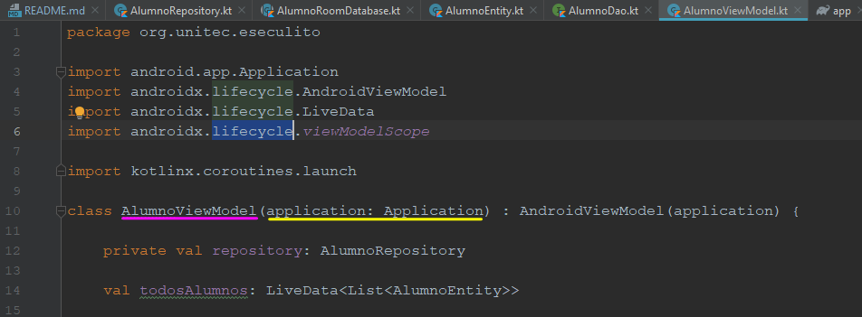

application hereda de la clase AndroidViewModelque recibe un argumento de tipo application. En este caso siempre se debe replicar el constructor padre (marcado en rojo) en el constructor hijo ( marcado en amarillo).

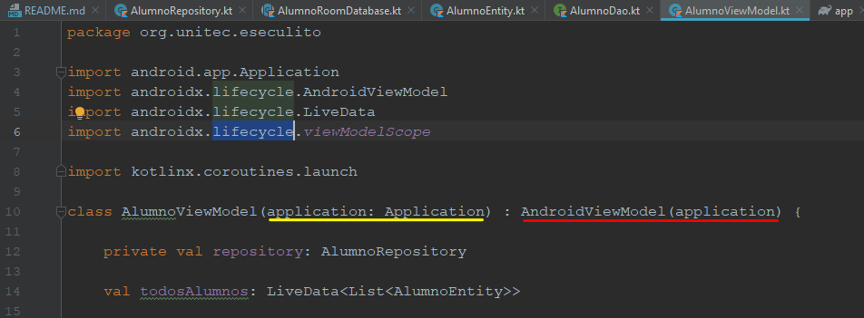

Declaramos un atributo que se llama AtributoRepository con la finalidad que estén disponibles las operaciones.

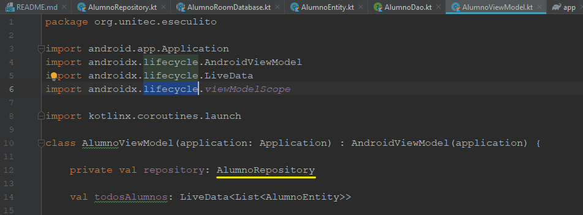

Inicializamos la variable todosAlumnos que es donde se va a inicializar la entidad Alumno, que es en la búsqueda de todos y aparecerá en listado.

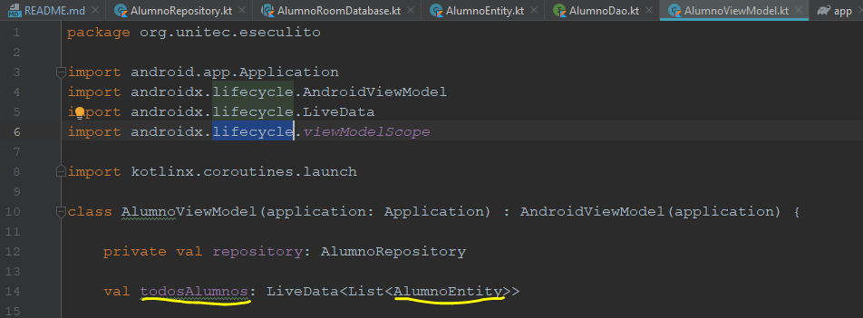

Cuando ponemos un INIT quiere decir que cuando se invoque la aplicación el bloque declarado se iniciará, invocamos la base de datos (amarillo),la obtengo(rojo), la enlazo a la aplicación (azul),se le indica que va a ser en el viemodelscope (el alcance de todo el viewmodel) y por último se generará el alumnoDao (rosa). Con esta línea se inicializa el AlumnoDao es decir como si se cargaran todas las operaciones de la base de datos. En caso de que se tuvieran más entidades se tendría que crear ésta línea para esas entidades.

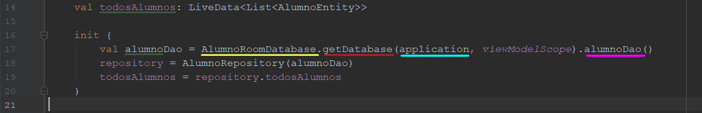

Inicializamos el repository pasandole el AlumnoDao y de igual forma el segundo atributo todosAlumnos.

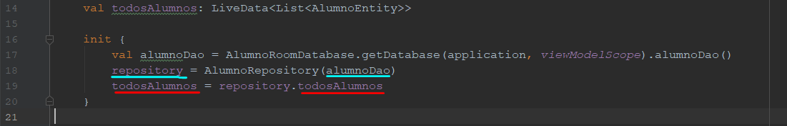

Creamos la función con el mismo nombre con el que se creó en el AlumnoDao,AlumnoRepository y en el ViweModel. en este caso "insertar",le pasamos el mismo argumento el cual se replica en los 3 que se mencionaron anteriormente (insertar(alumno:AlumnoEntity)), lo importante además es que lo inicializamos con el viewmodelscope (alcance), es decir se va a a inicilizar una vez que se lance (launch)la aplicación, es decir, que todo se cargue una vez que se corra la aplicación. Esto va a estar en el contexto de una coroutina la cual como ya vimos anteriormente es un tread que se lleva a cabo en el background independientemente que se esté  ejecutando una acción.

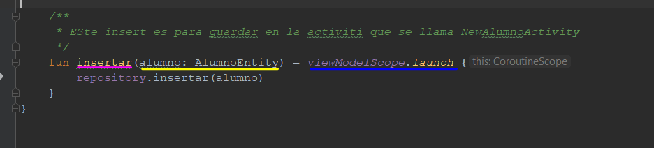

Invocamos el repositorio y le indicamos que "inserte" un alumno que la vamos a pasar una vez que se le invoque.

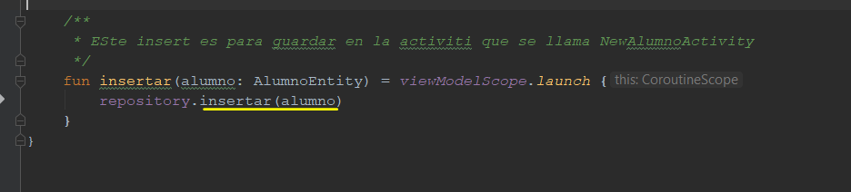

# Creando las LISTAS

Creamos un adaptador de listas el cual ya se va a enlazar a una componente visual, éste su usa cuando se quiere desplegar un listado de objetos de mensajes. 

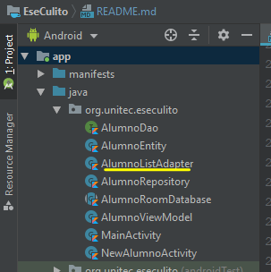

Este puede ser un poco más complejo ya que es un objeto que está compuesto de varias cosas, el cual se va a activar con el LiveData.

Tenemos la clase AlumnoListAdapter el cual tenemos un constructor con un atributo de tipo Context,el contexto es precisamente donde se invocan los id, es el que ayuda a invocar los id.

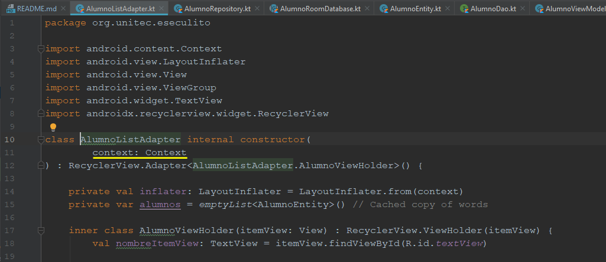

Recyclerview (Vista reciclada) se actualiza constantemente los listados.

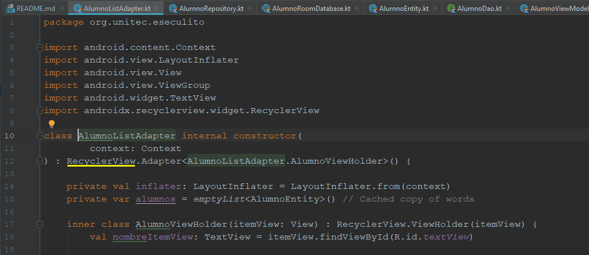

El primer atributo que tenemos es el inflater, es un inflador de la vista el cual despliega los datos, es el que lee las etiquetas de la interfaz de usuario. Lo inicializamos diciendo que el inflater es de tipo LayoutInflater el cual es el que va a llenar el layout el cual es donde se disponen todas las componentes.

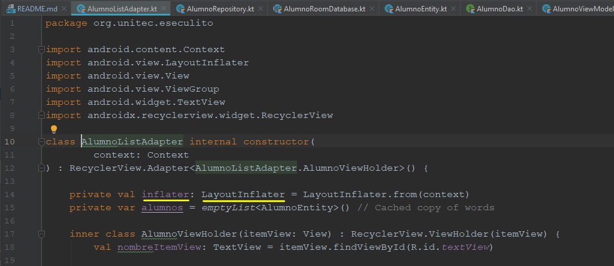

Con la clase LayoutInflater le indicamos que lo saque del contexto, en donde el conexto es el que invoca todos los id´s que se tengan en la vista.

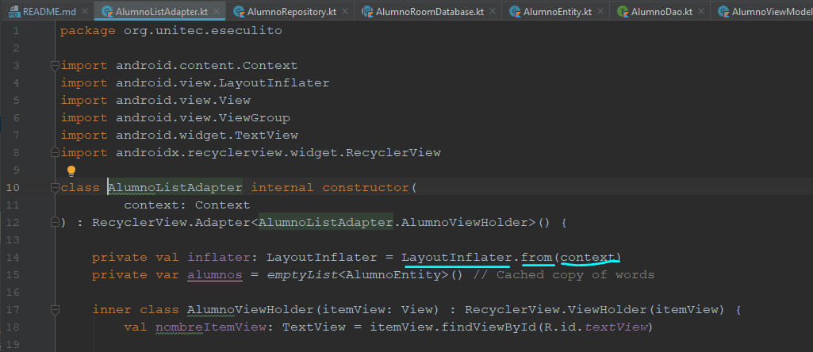

Generamos lo que vamos a llenar en la lista, en este caso serán "alumnos" , por lo que le indicamos que en una lista vacia lo haga genérico a un AlumnoEntity y lo colocamos en la var alumnos.

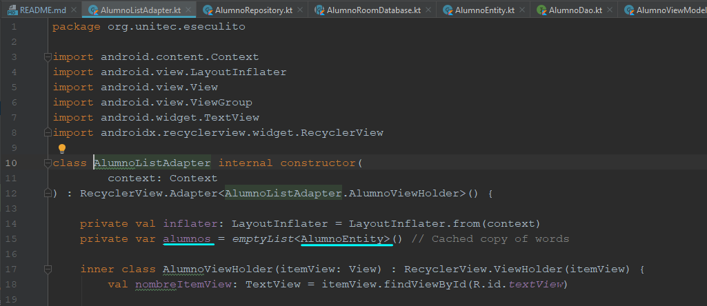

Creamos una clase interna la cual nos sirve para aprovechar las variables antes declaradas y usemos estos atributos en ésta clase interna. AlumnoViewHolder (holder es un contenedor) es decir un contenedor de alumnos, el cual puede ser un texview, editext, cualquier vista que se puso en el layout inmediatamente lo detecta el constructor.

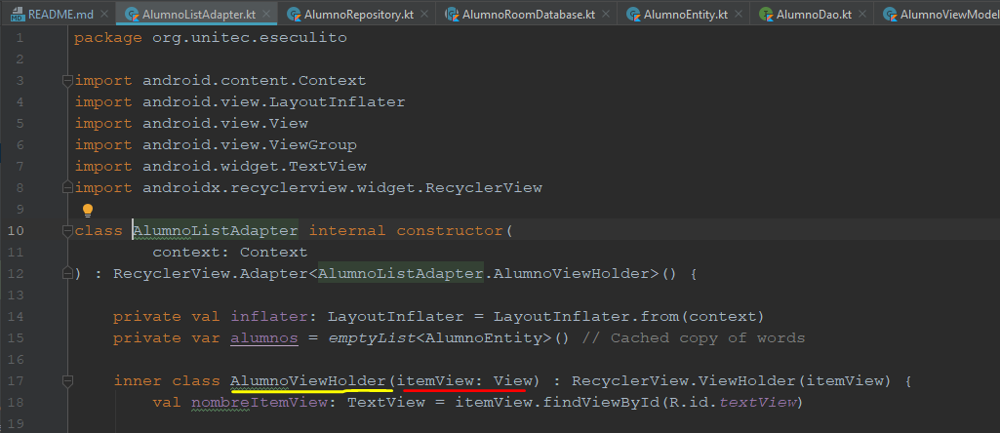

El view es lo siguiente:

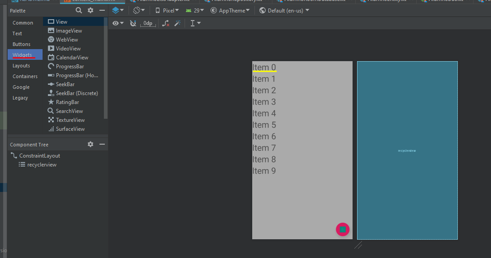

En este caso se puso un Textview:

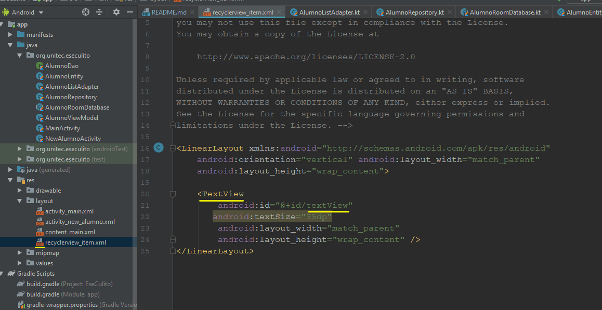

Val nombreItemView (pues solo quiero obtener el NOMBRE del alumno) el cual es de tipo textView e inmediatamente obtengo el id.TextView

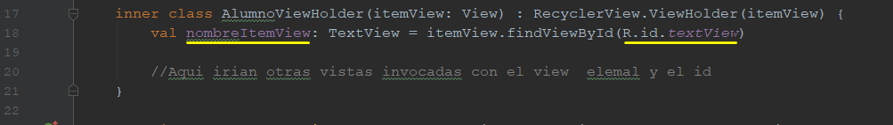

De la anterior ya estamos relacionando la Vista con el Modelo (ViewModel).

Una vez creada la Vista, el ViewGroup es todo lo que tenemos en el layout, el ViewTipe es un entero el cual si tenemos una imagen (icono del usuario= id0), textview para apellido = id1, texteview para fecha=id2, etc, ese entero es el que marcamos en rojo.

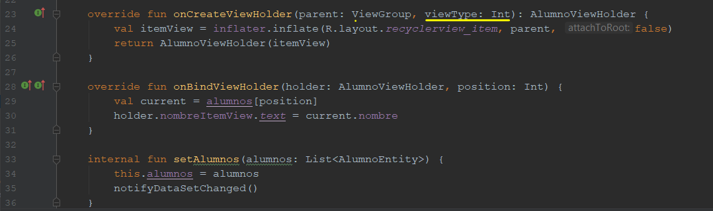

Del arreglo de alumnos que tenemos en la base de datos va a poner la posición del elemento que tenemos ahi.

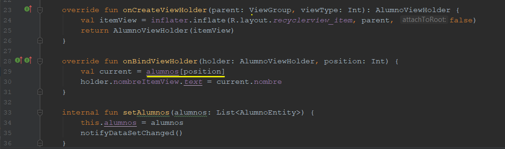

El current indicará la posición y le coloca el nombre que se tiene en esa posición.

Del método Recycleview tenemos un método que se llama notifyDataSetChanged, el cual en caso de que agregemos un nuevo alumno éste metodo lo notifica a la lista para que se actualice sin necesidad de agregar un botón para actualizar los datos.

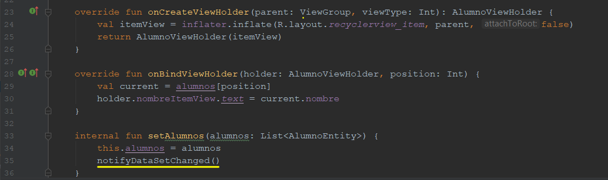

La función getItemCount() es opcional, pero en este caso lo colocamos para  saber cuantos elementos de la base de datos vamos a colocar en la lista.

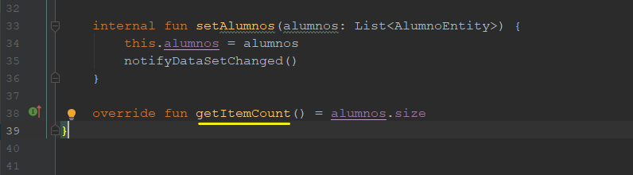

Si quisieramos que nos aparecieran mas variables en el layout, tendriamos que declararlas de la siguiente manera:

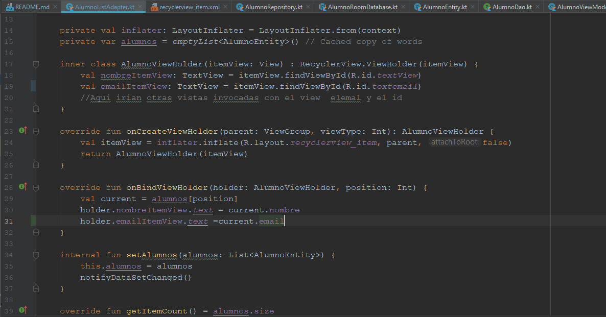

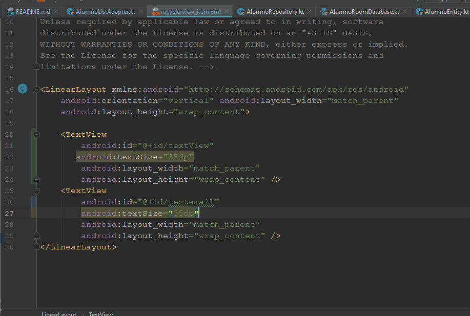

El último paso es enlazar todo en el MainActivity.